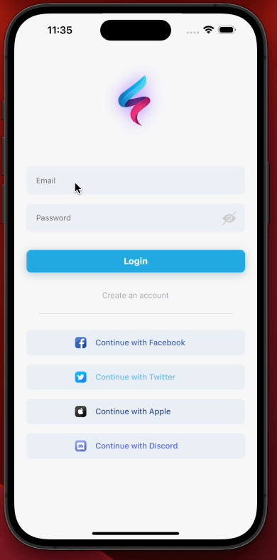

[](https://github.com/WrathChaos/react-native-login-screen)

[](https://github.com/WrathChaos/react-native-login-screen)

[](https://www.npmjs.com/package/react-native-login-screen)
[](https://www.npmjs.com/package/react-native-login-screen)

[](https://opensource.org/licenses/MIT)

<p align="center">
  
</p>

# 🥳 Version 3

Version 3 with the completely new UI

- Whole new UI / UX
- Simplistic Design
- Better Code Quality
- Fully Customizable
- Ready to use `SocialButton` Component
- Removed unstable dependencies
- `Only ONE dependency` is needed

## Installation

Add the dependency:

```js
npm i react-native-login-screen
```

## Peer Dependencies

###### IMPORTANT! You need install them.

```js
npm i react-native-text-input-interactive
```

```js
"react-native-text-input-interactive": ">= 0.1.3"
```

## Import

```js
import LoginScreen from "react-native-login-screen";
```

# Usage

```jsx
<LoginScreen
  logoImageSource={require("./assets/logo-example.png")}
  onLoginPress={() => {}}
  onSignupPress={() => {}}
  onEmailChange={(email: string) => {}}
  onPasswordChange={(password: string) => {}}
/>
```

## Usage with Social Button

Of course you can put any `children` into the LoginScreen, I recommend you to use `SocialButton`.

```jsx
import LoginScreen, { SocialButton } from "react-native-login-screen";

<LoginScreen
  logoImageSource={require("./assets/logo-example.png")}
  onLoginPress={() => {}}
  onSignupPress={() => {}}
  onEmailChange={(email: string) => {}}
  onPasswordChange={(password: string) => {}}
>
  <SocialButton text="Continue with Google" onPress={() => {}} />
  <SocialButton
    text="Continue with Facebook"
    imageSource={require("./assets/social/facebook.png")}
    onPress={() => {}}
  />
  <SocialButton
    text="Continue with Twitter"
    imageSource={require("./assets/social/twitter.png")}
    onPress={() => {}}
  />
</LoginScreen>;
```

## Configuration - Props

### Fundamentals

| Property         |   Type   |  Default  | Description                                                   |
| ---------------- | :------: | :-------: | ------------------------------------------------------------- |
| onLoginPress     | function | undefined | set your own function when the `login button` is pressed      |
| onSignupPress    | function | undefined | set your own function when the `Create an account` is pressed |
| onEmailChange    | function | undefined | set your own function when `email` textinput has a change     |
| onPasswordChange | function | undefined | set your own function when `password` textinput has a change  |
| logoImageSource  |  source  | undefined | set your own logo                                             |

### Customizations (Optional)

| Property                |    Type    |       Default       | Description                                         |
| ----------------------- | :--------: | :-----------------: | --------------------------------------------------- |
| signupText              |   string   | "Create an account" | change the sign up text                             |
| disableSignup           |  boolean   |        false        | disable the signup if you do not want to use it     |
| disableDivider          |  boolean   |        false        | disable the divider if you do not want to use it    |
| disableSocialButtons    |  boolean   |        false        | disable the all social buttons                      |
| emailPlaceholder        |   string   |       "Email"       | change email placeholder text                       |
| passwordPlaceholder     |   string   |     "Password"      | change password placeholder text                    |
| style                   | ViewStyle  |       default       | set/override the default style for the container    |
| dividerStyle            | ViewStyle  |       default       | set/override the default divider style              |
| logoImageStyle          | ImageStyle |       default       | set/override the default image style                |
| textInputContainerStyle | ViewStyle  |       default       | set/override the default text input container style |
| loginButtonStyle        | ViewStyle  |       default       | set/override the default login button style         |
| loginTextStyle          | TextStyle  |       default       | set/override the default login text style           |
| signupStyle             | ViewStyle  |       default       | set/override the default signup button style        |
| signupTextStyle         | TextStyle  |       default       | set/override the default signup text style          |

### Default Social Login Buttons (Optional)

| Property        |   Type   |  Default  | Description                                                  |
| --------------- | :------: | :-------: | ------------------------------------------------------------ |
| onFacebookPress | function | undefined | set your own function for the `Facebook` social button press |
| onTwitterPress  | function | undefined | set your own function for the `Twitter` social button press  |
| onApplePress    | function | undefined | set your own function for the `Apple` social button press    |
| onDiscordPress  | function | undefined | set your own function for the `Discord` social button press  |

# Version 2 is still available

if you do not like the new design, you can still use the old design :)

```js
npm i react-native-login-screen@2.1.4
```

<p align="left">
  
</p>

### Roadmap

- [x] ~~LICENSE~~
- [x] ~~Android Design Bug Fixes~~
- [x] ~~Configuration - Props COMING SOON~~
- [x] ~~Typescript Challenge!~~
- [x] ~~Remove some dependencies~~
- [x] ~~Better TextField Library Integration~~
- [ ] Write an article about the lib on Medium
- [ ] Write an article about the lib on DevTO

## Credits

For the awesome photo thanks to [jcob nasyr from Unsplash](https://unsplash.com/photos/67sVPjK6Q7I)

## Author

FreakyCoder, kurayogun@gmail.com

## License

React Native Login Screen is available under the MIT license. See the LICENSE file for more info.
