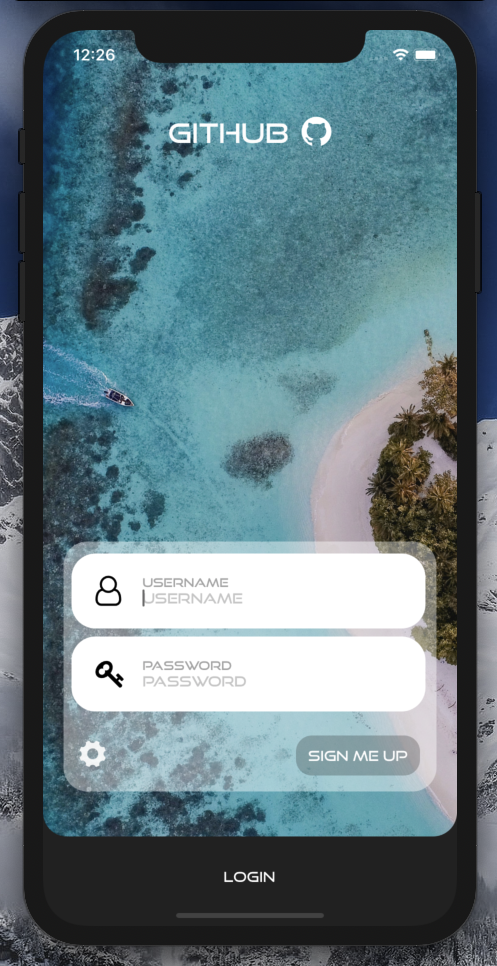
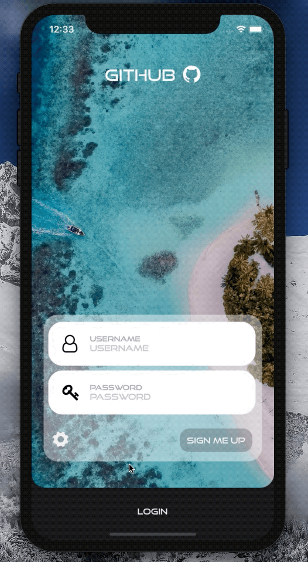
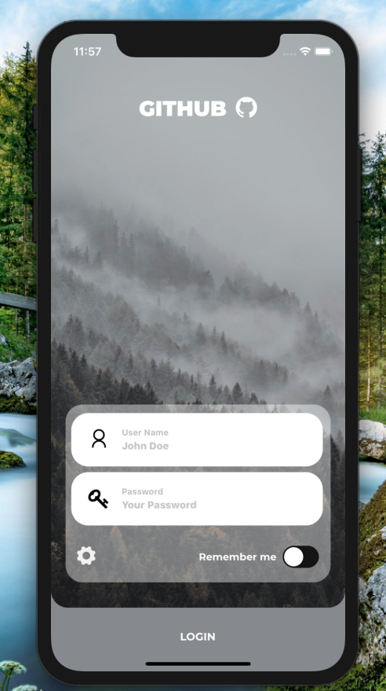

[](https://github.com/WrathChaos/react-native-login-screen)


[](https://github.com/WrathChaos/react-native-login-screen)


[](https://www.npmjs.com/package/react-native-login-screen)
[](https://www.npmjs.com/package/react-native-login-screen)

[](https://opensource.org/licenses/MIT)

<p align="center">
  
  
</p>

## Installation

Add the dependency:

### React Native:

```ruby
npm i react-native-login-screen
```

## Peer Dependencies

###### IMPORTANT! You need install them.

```
"react": ">= 16.x.x",
"react-native": ">= 0.55.x",
"react-native-vector-icons": ">= 6.6.0",
"react-native-improved-text-input": ">= 0.0.1",
"react-native-dynamic-vector-icons": ">= 0.2.1"
```

## Import

```js
import LoginScreen from "react-native-login-screen";
```

# Usage

## One Line Code to Get A Login Screen !

```js
<LoginScreen />
```


# Customizable Advanced Usage

Fully Customizable & Ready to Use Login Screen. You can customize anything on the login screen

<p align="center">
  
</p>

```js
<LoginScreen
  source={{
    uri: bgImage
  }}
  onPress={loginPressed}
  loginButtonBackgroundColor="#a2a5a9"
  logoComponent={your-logo-component}
  passwordIconComponent={your-icon-component-for-password}
  usernameIconComponent={your-icon-component-for-username}
  onSwitchValueChange={switchValue => {
    setSwitchValue(switchValue);
  }}
  switchValue={switchValue}
  usernameOnChangeText={username => setUsername(username)}
  passwordOnChangeText={password => alert("Password: ", password)}
>
  <View
    style={{
      position: "relative",
      alignSelf: "center",
      marginTop: 64
    }}
  >
    <Text style={{ color: "white", fontSize: 30 }}>{switchValue}</Text>
  </View>
</LoginScreen>
```


### Configuration - Props

 #### Coming Soon !


### Future Plans

- [ ] Configuration - Props COMING SOON
- [x] ~~LICENSE~~
- [ ] Write an article about the lib on Medium


## Author

FreakyCoder, kurayogun@gmail.com

## License

React Native Login Screen is available under the MIT license. See the LICENSE file for more info.
