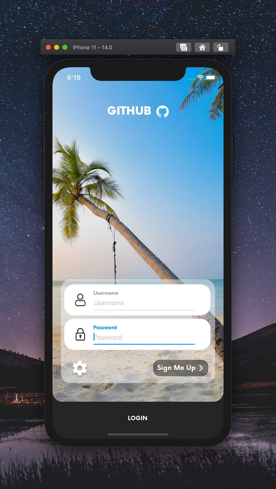

[](https://github.com/WrathChaos/react-native-login-screen)

[](https://github.com/WrathChaos/react-native-login-screen)

[](https://www.npmjs.com/package/react-native-login-screen)
[](https://www.npmjs.com/package/react-native-login-screen)

[](https://opensource.org/licenses/MIT)

<p align="center">
  
  
</p>

## Installation

Add the dependency:

```js
npm i react-native-login-screen
```

## Peer Dependencies

###### IMPORTANT! You need install them.

```js
"react-native-spinkit": ">= 1.5.0",
"@freakycoder/react-native-helpers": ">= 0.1.3",
"@freakycoder/react-native-material-textfield": ">= 1.0.0"
```

## Import

```js
import LoginScreen from "react-native-login-screen";
```

# Usage

### 😍 One Line Code to Get The Whole Login Screen 🎉

```jsx
<LoginScreen />
```

# Customizable Advanced Usage

Fully Customizable & Ready to Use Login Screen. You can customize anything on the login screen. Check the example :)

# Advanced Usage with Custom Children

Pretty advanced and fully customizable example of login screen

```jsx
<LoginScreen
  spinnerEnable
  spinnerVisibility={spinnerVisibility}
  labelTextStyle={{
    color: "#adadad",
    fontFamily: "Now-Bold",
  }}
  logoTextStyle={{
    fontSize: 27,
    color: "#fdfdfd",
    fontFamily: "Now-Black",
  }}
  loginButtonTextStyle={{
    color: "#fdfdfd",
    fontFamily: "Now-Bold",
  }}
  textStyle={{
    color: "#757575",
    fontFamily: "Now-Regular",
  }}
  signupStyle={{
    color: "#fdfdfd",
    fontFamily: "Now-Bold",
  }}
  usernameOnChangeText={(username) => console.log("Username: ", username)}
  onPressSettings={() => alert("Settings Button is pressed")}
  passwordOnChangeText={(password) => console.log("Password: ", password)}
  onPressLogin={() => {
    setSpinnerVisibility(true);
    setTimeout(() => {
      setSpinnerVisibility(false);
    }, 2000);
  }}
  onPressSignup={() => {
    console.log("onPressSignUp is pressed");
  }}
>
  <View
    style={{
      position: "relative",
      alignSelf: "center",
      marginTop: 64,
    }}
  >
    <Text style={{ color: "white", fontSize: 30 }}>
      Inside Login Screen Component
    </Text>
  </View>
</LoginScreen>
```

## Configuration - Props

### Fundamentals

| Property                   |   Type    |    Default     | Description                                                              |
| -------------------------- | :-------: | :------------: | ------------------------------------------------------------------------ |
| source                     | local/uri | unsplash image | change the background image with local or uri prop                       |
| onPressLogin               | function  |   undefined    | set your own functional logic for `login button` is pressed              |
| onPressSettings            | function  |   undefined    | set your own functional logic for `settings button` is pressed           |
| usernameOnChangeText       | function  |   undefined    | set your own functional logic for `username` onChange value              |
| passwordOnChangeText       | function  |   undefined    | set your own functional logic for `password` onChange value              |
| loginButtonBackgroundColor |   color   |    #282828     | change the login button's background color                               |
| loginText                  |  string   |     LOGIN      | change the login button's text                                           |
| loginButtonTextStyle       |   style   |    default     | set your own style for the login button's text style                     |
| logoComponent              | component |      Icon      | set your own logo component instead of default Icon                      |
| spinnerEnable              |   bool    |     false      | set the spinner enable this is **required** to use spinner               |
| spinnerVisibility          |   bool    |     false      | set the logic for spinner enabling / disabling for the login text button |
| spinnerColor               |   color   |    #fdfdfd     | change the spinner color                                                 |
| spinnerSize                |  number   |       30       | change the spinner size                                                  |
| spinnerType                |   bool    |     false      | change the spinner type                                                  |
| spinnerStyle               |   bool    |     false      | set your own style for the spinner itself                                |

### Bottom Container Props

| Property               |   Type    |        Default         | Description                                                                  |
| ---------------------- | :-------: | :--------------------: | ---------------------------------------------------------------------------- |
| placeholder            |  string   |        default         | set the placeholder of the text input with both title and placeholder itself |
| backgroundColor        |   color   | rgba(255,255,255,0.45) | change the bottom container's background color                               |
| disableSettings        |  boolean  |         false          | disable the settings button if you do not want it                            |
| disableSignupButton    |  boolean  |         false          | disable the signup button if you do not want it                              |
| usernameIconComponent  | component |        default         | set any component instead of username icon component                         |
| passwordIconComponent  | component |        default         | set any component instead of password icon component                         |
| settingsIconComponent  | component |        default         | set any component instead of settings icon component                         |
| usernameTextInputValue |   value   |        default         | set username's text input value                                              |
| passwordTextInputValue |   value   |        default         | set password's text input value                                              |
| usernamePlaceholder    |  string   |        Username        | change the username text input's placeholder                                 |
| passwordPlaceholder    |  string   |        Password        | change the password text input's placeholder                                 |
| usernameTitle          |  string   |        Username        | change the username title                                                    |
| passwordTitle          |  string   |        Password        | change the password title                                                    |

# Changelog

## [Unreleased](https://github.com/WrathChaos/react-native-login-screen/tree/HEAD)

[Full Changelog](https://github.com/WrathChaos/react-native-login-screen/compare/2.0.3...HEAD)

**Fixed bugs:**

- onPressSignup breaks the card swap functionality [\#13](https://github.com/WrathChaos/react-native-login-screen/issues/13)

## [2.0.3](https://github.com/WrathChaos/react-native-login-screen/tree/2.0.3) (2020-09-20)

[Full Changelog](https://github.com/WrathChaos/react-native-login-screen/compare/2.0.0...2.0.3)

## [2.0.0](https://github.com/WrathChaos/react-native-login-screen/tree/2.0.0) (2020-09-20)

[Full Changelog](https://github.com/WrathChaos/react-native-login-screen/compare/2.0.2...2.0.0)

## [2.0.2](https://github.com/WrathChaos/react-native-login-screen/tree/2.0.2) (2020-09-20)

[Full Changelog](https://github.com/WrathChaos/react-native-login-screen/compare/1.0.0...2.0.2)

**Implemented enhancements:**

- Couple of Ideas by leitooop [\#6](https://github.com/WrathChaos/react-native-login-screen/issues/6)

**Fixed bugs:**

- Login button too down on Android [\#7](https://github.com/WrathChaos/react-native-login-screen/issues/7)

**Merged pull requests:**

- Bump handlebars from 4.3.0 to 4.7.6 in /example [\#12](https://github.com/WrathChaos/react-native-login-screen/pull/12) ([dependabot[bot]](https://github.com/apps/dependabot))
- Bump lodash from 4.17.15 to 4.17.19 in /example [\#10](https://github.com/WrathChaos/react-native-login-screen/pull/10) ([dependabot[bot]](https://github.com/apps/dependabot))
- Add props disableSignupButton [\#8](https://github.com/WrathChaos/react-native-login-screen/pull/8) ([pasdoy](https://github.com/pasdoy))

## [1.0.0](https://github.com/WrathChaos/react-native-login-screen/tree/1.0.0) (2020-06-07)

[Full Changelog](https://github.com/WrathChaos/react-native-login-screen/compare/0.3.7...1.0.0)

**Merged pull requests:**

- Bump acorn from 5.7.3 to 5.7.4 in /example [\#4](https://github.com/WrathChaos/react-native-login-screen/pull/4) ([dependabot[bot]](https://github.com/apps/dependabot))

## [0.3.7](https://github.com/WrathChaos/react-native-login-screen/tree/0.3.7) (2020-02-26)

[Full Changelog](https://github.com/WrathChaos/react-native-login-screen/compare/0.3.6...0.3.7)

**Closed issues:**

- Issue with '@expo/vector-icons/Fontisto' [\#3](https://github.com/WrathChaos/react-native-login-screen/issues/3)

## [0.3.6](https://github.com/WrathChaos/react-native-login-screen/tree/0.3.6) (2020-01-31)

[Full Changelog](https://github.com/WrathChaos/react-native-login-screen/compare/0.3.5...0.3.6)

**Implemented enhancements:**

- More Customizable Props [\#2](https://github.com/WrathChaos/react-native-login-screen/issues/2)

**Fixed bugs:**

- Get an error about font family "Monterrat-black" not being found [\#1](https://github.com/WrathChaos/react-native-login-screen/issues/1)

## [0.3.5](https://github.com/WrathChaos/react-native-login-screen/tree/0.3.5) (2020-01-26)

[Full Changelog](https://github.com/WrathChaos/react-native-login-screen/compare/0.3.4...0.3.5)

## [0.3.4](https://github.com/WrathChaos/react-native-login-screen/tree/0.3.4) (2020-01-24)

[Full Changelog](https://github.com/WrathChaos/react-native-login-screen/compare/0.3.3...0.3.4)

## [0.3.3](https://github.com/WrathChaos/react-native-login-screen/tree/0.3.3) (2020-01-23)

[Full Changelog](https://github.com/WrathChaos/react-native-login-screen/compare/0.3.2...0.3.3)

## [0.3.2](https://github.com/WrathChaos/react-native-login-screen/tree/0.3.2) (2020-01-09)

[Full Changelog](https://github.com/WrathChaos/react-native-login-screen/compare/0.3.1...0.3.2)

## [0.3.1](https://github.com/WrathChaos/react-native-login-screen/tree/0.3.1) (2020-01-09)

[Full Changelog](https://github.com/WrathChaos/react-native-login-screen/compare/0.3.0...0.3.1)

## [0.3.0](https://github.com/WrathChaos/react-native-login-screen/tree/0.3.0) (2020-01-09)

[Full Changelog](https://github.com/WrathChaos/react-native-login-screen/compare/0.2.5...0.3.0)

## [0.2.5](https://github.com/WrathChaos/react-native-login-screen/tree/0.2.5) (2019-12-16)

[Full Changelog](https://github.com/WrathChaos/react-native-login-screen/compare/0.2.4...0.2.5)

## [0.2.4](https://github.com/WrathChaos/react-native-login-screen/tree/0.2.4) (2019-12-15)

[Full Changelog](https://github.com/WrathChaos/react-native-login-screen/compare/0.2.2...0.2.4)

## [0.2.2](https://github.com/WrathChaos/react-native-login-screen/tree/0.2.2) (2019-12-15)

[Full Changelog](https://github.com/WrathChaos/react-native-login-screen/compare/0.2.1...0.2.2)

## [0.2.1](https://github.com/WrathChaos/react-native-login-screen/tree/0.2.1) (2019-12-12)

[Full Changelog](https://github.com/WrathChaos/react-native-login-screen/compare/0.2.0...0.2.1)

## [0.2.0](https://github.com/WrathChaos/react-native-login-screen/tree/0.2.0) (2019-12-09)

[Full Changelog](https://github.com/WrathChaos/react-native-login-screen/compare/0.1.12...0.2.0)

## [0.1.12](https://github.com/WrathChaos/react-native-login-screen/tree/0.1.12) (2019-12-05)

[Full Changelog](https://github.com/WrathChaos/react-native-login-screen/compare/0.1.11...0.1.12)

## [0.1.11](https://github.com/WrathChaos/react-native-login-screen/tree/0.1.11) (2019-09-29)

[Full Changelog](https://github.com/WrathChaos/react-native-login-screen/compare/feb6fc076e40282a5d77381f6ec0279d777d2c22...0.1.11)

\* _This Changelog was automatically generated by [github_changelog_generator](https://github.com/github-changelog-generator/github-changelog-generator)_

### Roadmap

- [x] ~~LICENSE~~
- [x] ~~Android Design Bug Fixes~~
- [x] ~~Configuration - Props COMING SOON~~
- [x] ~~Typescript Challenge!~~
- [x] ~~Remove some dependencies~~
- [ ] ImageComponent Feature Option
- [ ] Better TextField Library Integration
- [ ] Write an article about the lib on Medium

## Credits

For the awesome photo thanks to [jcob nasyr from Unsplash](https://unsplash.com/photos/67sVPjK6Q7I)

## Author

FreakyCoder, kurayogun@gmail.com

## License

React Native Login Screen is available under the MIT license. See the LICENSE file for more info.
